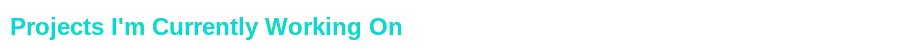
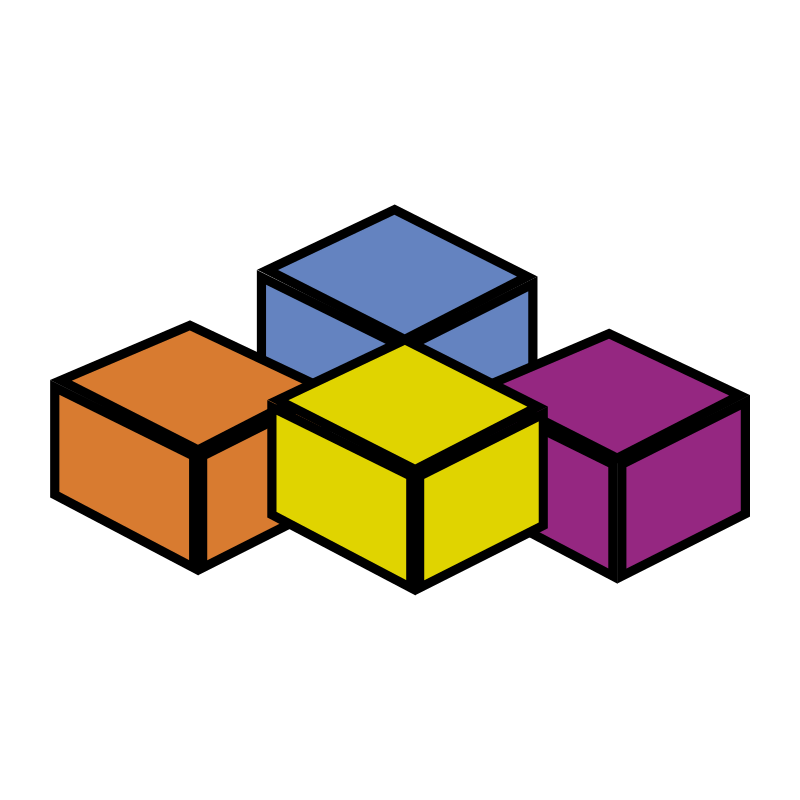

  
  

  
**`> Netrunner (Developer/Writer/Producer)`**

**`> Location: Mexico | Age: 18`**

**`> Passionate about tech, software, and building real solutions.`**

I’m a self-taught software engineer and a technical informatics student focused on continuous learning, experimenting, and creating projects that solve problems or spark joy.

---

  
  

- Backend & Frontend Development: Building APIs, web apps, and automations! 
- Data Analysis & Visualization: Turning data into insights! 
- Game Dev: Turning universes into games!

---

  
  

I'm deeply involved in several ambitious projects that help me grow and improve as a developer. Here's a quick overview of what I'm working on and how I prioritize them:

  
  

- **Memory Zero** — My main game currently in active development.  
- **POS with DDD, Hexagonal & Clean Architecture** — Initial backend using Javalin and SQLite.  

  
  

- License management backend (in development).  
- Automated password generation system with customizable parameters.  
- Improvements to my Python-based JAR launcher.  
- Enhancements to an API for downloading music and other content.  

  
  

- Database built solely using lists and maps — Long-term research and development (Skyedb).  

---

If you want to know more about any of these, just ask or check out my repos when they're public.  
I'm always learning and creating, and these projects reflect my passion and determination.

  
  

  
  
  
  
  
  
  
  
  
  

---

  
  

  
  

  

  

  

---

  
  

- Master full-stack development and build my own software projects & startups.  
- Grow StarVortex Technology and Echo Studios as my tech & game dev companies.  
- Constantly improve my skills in cybersecurity, math, and programming.

---

  
  

 

---

  
  

 

I’m also a big fan of physics and math!  

---

Thanks for stopping by my profile! Feel free to explore my repos and reach out if you want to collaborate or chat tech!

<!--
**RegreDanger/RegreDanger** is a ✨ _special_ ✨ repository because its `README.md` (this file) appears on your GitHub profile.

Here are some ideas to get you started:

- 🔭 I’m currently working on ...
- 🌱 I’m currently learning ...
- 👯 I’m looking to collaborate on ...
- 🤔 I’m looking for help with ...
- 💬 Ask me about ...
- 📫 How to reach me: ...
- 😄 Pronouns: ...
- ⚡ Fun fact: ...
-->
