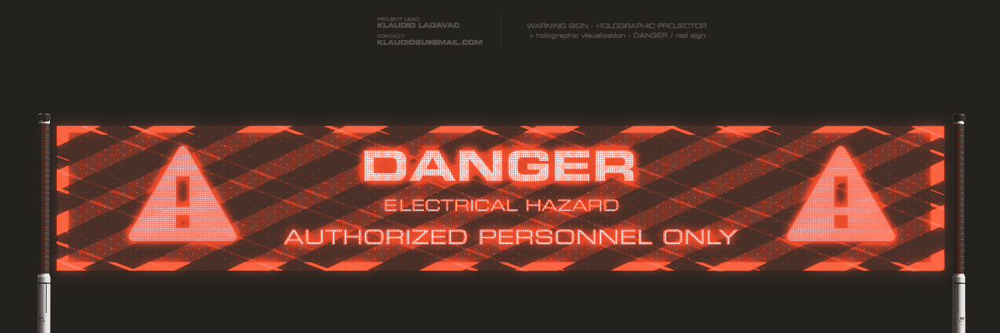

<picture>
  <source media="(prefers-color-scheme: light)" srcset="https://raw.githubusercontent.com/RegreDanger/RegreDanger/output/github-stats.png">
  <source media="(prefers-color-scheme: dark)" srcset="https://raw.githubusercontent.com/RegreDanger/RegreDanger/output/github-stats-dark.png">
  
</picture>

## `> Hi! I'm RegreDanger_`
**`> Netrunner | Digital explorer and code architect in the vast network of cyberspace`**

**`> Roles: (Developer/Writer/Producer)`**

**`> Passionate about tech & software, always looking forward for building helpful and useful software`**

I’m someone who explores systems deeply, understands how things connect, and learns by moving through layers rather than staying on the surface.
For me, software isn’t just a career path or a checklist of skills — it’s a long-term practice. 

My main strengths are backend development and data analysis, but my curiosity goes far beyond a single role. I’m currently studying frontend and game development, and I intentionally explore multiple areas of software over time, seeing learning as a continuous, lifelong process rather than something to rush, “finish,” or give an expiration date. 

Right now, my focus is on building software that is genuinely useful, helpful, and meaningful. Code is a tool to help people, explore ideas, and create systems that make sense — not just a way to chase buzzwords or money. 

StarVortex Technology is part of that mindset. It’s not a company, but a collective space where ideas, software, experiments, and creative projects live and evolve — a place to build, learn, and grow without forcing things into a corporate shape. 

I build slowly when needed, think carefully before implementing, and value understanding over speed. Exploration, intention, and responsibility matter more to me than appearances. 

Thanks for stopping by my profile! Feel free to explore my repos and reach out if you want to collaborate or chat tech! 

  

  

  

  

 

---

# `> Languages & Tools_`

<!--
**RegreDanger/RegreDanger** is a ✨ _special_ ✨ repository because its `README.md` (this file) appears on your GitHub profile.

Here are some ideas to get you started:

- 🔭 I’m currently working on ...
- 🌱 I’m currently learning ...
- 👯 I’m looking to collaborate on ...
- 🤔 I’m looking for help with ...
- 💬 Ask me about ...
- 📫 How to reach me: ...
- 😄 Pronouns: ...
- ⚡ Fun fact: ...
-->
